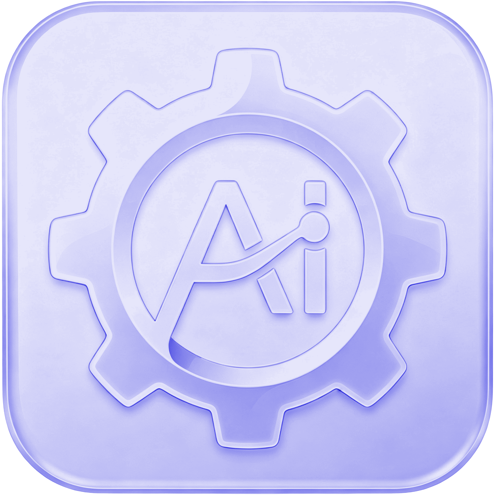
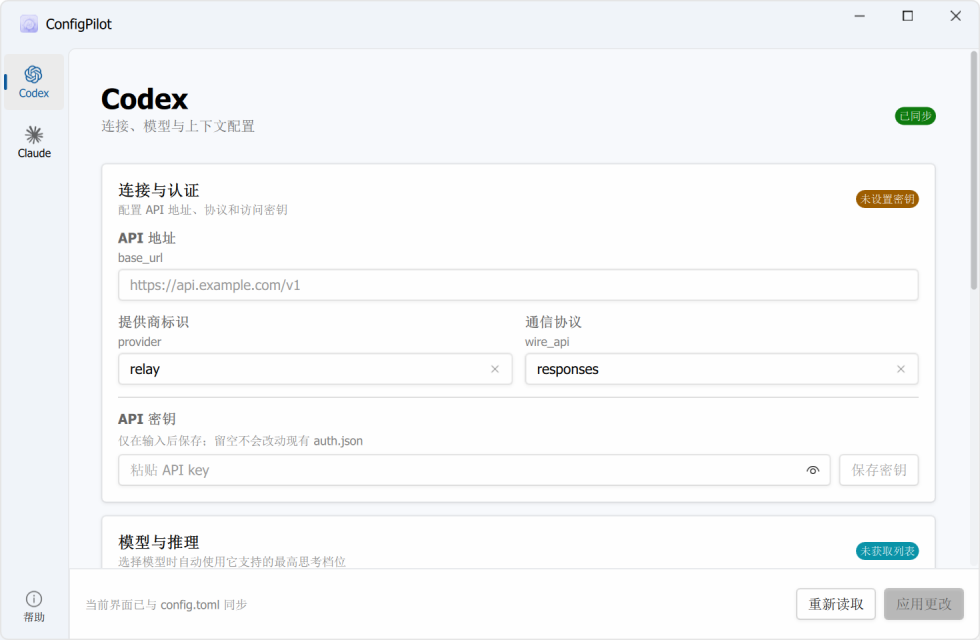

# ConfigPilot

<p align="center">
  
</p>

**AI 工具配置与自动化中心。**

ConfigPilot 是一个用 [PrismQML](https://pypi.org/project/prismqml/) 构建的桌面工具。当前支持 OpenAI Codex CLI 与 Claude Desktop：既能管理 `~/.codex/config.toml`，也能一键启用 Claude Desktop Developer Mode 并配置 Third-Party Inference Gateway，免去手动编辑 TOML/JSON。



- **下载**：[GitHub Releases](../../releases)
- **自动更新**：启动后自动检查 GitHub Releases；Windows 可在应用内下载、静默安装并重启，macOS 会打开官方发布页完成升级。
- **适合**：需要频繁切换 Codex CLI provider，或希望让 Claude Desktop 使用第三方 `/v1/messages` Gateway，但不想手动编辑 TOML/JSON 的用户。

## 功能

- **API 连接配置**：填写 `base_url`、provider、wire API 和模型；地址末尾缺少 `/v1` 时自动补全
- **高级选项**（都是 Codex 原生 `config.toml` 字段）：
  - `requires_openai_auth` —— 供应商用 Chat Completions 协议或非 GPT 模型时开启
  - `model_reasoning_effort` —— 优先从远端模型目录读取；普通选择器过滤需单独开启的 Max / Ultra，GPT-5.6 显示“轻度 / 中 / 高 / 极高”四档
  - `disable_response_storage` —— 禁用响应存储
- **稳定上下文预设**：所有受支持模型统一使用 GPT-5.5 的稳定值 `258400 / 245000 / 6000`
- **响应式界面**：连接、模型、上下文和兼容性分区展示，窄窗口自动切换为单列
- **获取模型**：请求中转的 `/v1/models`，结果填入 model 下拉（后台线程，不卡界面）
- **API key**：写入 `~/.codex/auth.json`
- **安全**：每次写入前自动备份 `config.toml.bak` / `auth.json.bak`，保留 `notify` 等其它原有配置不动
- **常驻操作栏**：随时查看未应用状态，并可重新读取或应用配置
- **Claude Desktop Subpage**：直接写入 Claude 自己的本地配置库，一键启用 Developer Mode 与 `deploymentMode=3p`
- **第三方推理 Gateway**：配置 endpoint、`bearer` / `x-api-key`、API key、模型列表和额外 Header，endpoint 缺少 `/v1` 时自动补全
- **Claude 配置安全**：编辑当前已应用配置，敏感字段留空默认保留；写入前创建 `.bak`，损坏的现有 JSON 会拒绝覆盖

> Claude Desktop 配置写入后必须完全退出并重新打开。ConfigPilot 不会强制结束正在运行的 Cowork / Code 会话。

## 安装使用（终端用户）

### Windows

下载 [Releases](../../releases) 里的 `ConfigPilot_Setup_x.x.x.exe`，双击安装即可。无需 Python，VC++ 运行库已内置。

### macOS（Apple Silicon）

下载 `ConfigPilot_x.x.x_arm64.dmg`，打开后把 `ConfigPilot` 拖入 `Applications`。当前 macOS 包仅支持 Apple Silicon（M 系列芯片），暂不支持 Intel Mac。

> **首次打开说明：**维护者目前没有 Apple Developer Program 会员，因此 DMG 尚未使用 Developer ID 签名和 Apple 公证。macOS Gatekeeper 可能显示“应用已损坏”，但这不代表下载文件真的损坏。请只从本项目官方 Releases 下载，然后在“终端”执行一次：

```bash
xattr -dr com.apple.quarantine "/Applications/ConfigPilot.app"
open "/Applications/ConfigPilot.app"
```

同一已安装版本通常只需执行一次；重新下载或升级后，系统可能再次添加隔离标记。正式签名与公证会在具备 Apple Developer Program 会员后接入。

## 从源码运行（开发者）

需要 Python 3.11+（用到 `tomllib`）。

```bash
git clone https://github.com/aki-riko/ConfigPilot.git
cd configpilot
python -m venv .venv
.venv\Scripts\activate          # Windows
pip install -r requirements.txt
python main.py
```

或直接双击 `run.cmd`（自动用 `.venv`，没有则回退系统 Python）。

<!--__BUILD_SECTION__-->
## 打包分发

**Nuitka 打包成 standalone：**

```bash
build_nuitka.cmd
```
产物在 `build\main.dist\`。可手动删除 `build\main.dist\` 下的 `qt6webengine*.dll` 和 `PySide6\qml\QtWebEngine` 省约 200MB（本工具用不到）。

**Inno Setup 制作安装程序**（需 [Inno Setup 6+](https://jrsoftware.org/isdl.php)）：

```bash
ISCC ConfigPilot.iss
```
产物在 `installer\ConfigPilot_Setup_x.x.x.exe`。

## 配置 providers.json

默认中转列表，供“重置为默认”使用。`name` 是说明名称，其余字段对应写入 `config.toml`：

```json
{
  "presets": [
    {
      "name": "https://api.example.com",
      "baseUrl": "https://api.example.com/v1",
      "provider": "relay",
      "wireApi": "responses",
      "model": "gpt-5.5"
    }
  ]
}
```

## 目录结构

```
configpilot/
├── main.py                  入口:注册后端 / svg 图标 provider
├── backend/
│   ├── codex_config.py      配置读写 + 获取模型(后台线程)
│   ├── claude_desktop_config.py  Developer Mode + 第三方推理配置
│   └── model_profiles.py    模型规则加载与校验
├── qml/
│   ├── main.qml             窗口 + 导航 + 启动屏 + 图标
│   └── views/
│       ├── CodexView.qml    Codex 配置页
│       ├── ClaudeDesktopView.qml  Claude Desktop Subpage
│       ├── AboutView.qml    帮助页
│       └── ReasoningEffortSelector.qml  思考等级选择器
├── resources/               程序图标 (svg/ico)
├── providers.json           中转预置列表
├── model_profiles.json      模型思考等级与上下文预设
├── requirements.txt         运行依赖
├── build_nuitka.cmd         Nuitka 打包脚本
├── ConfigPilot.iss          Inno Setup 安装脚本
└── run.cmd                  开发期快速启动
```

## 许可证

[MIT](LICENSE) © 2026 aki-riko

基于 [PrismQML](https://pypi.org/project/prismqml/)（MIT）构建。
